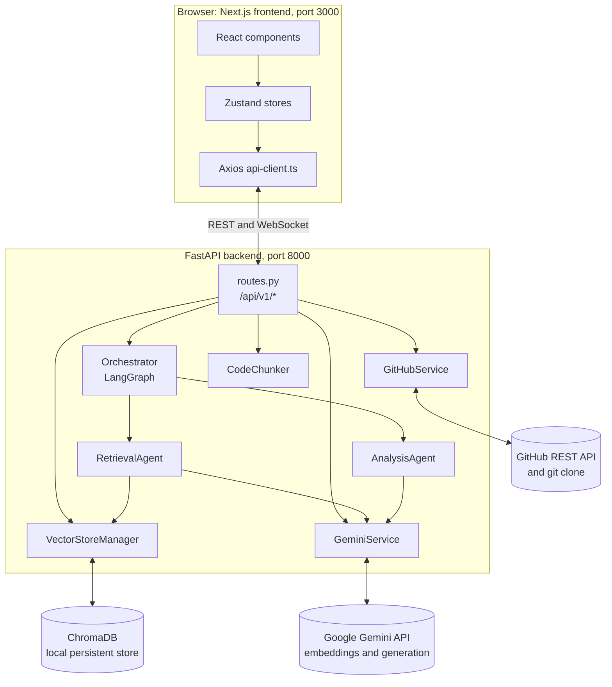
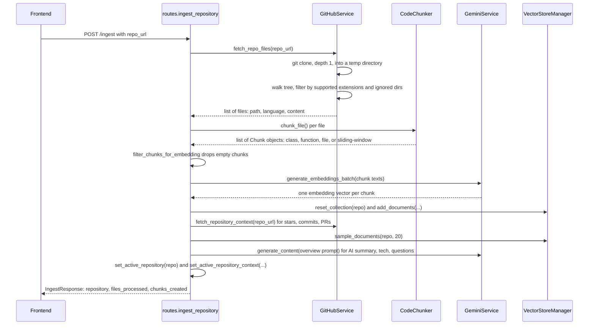
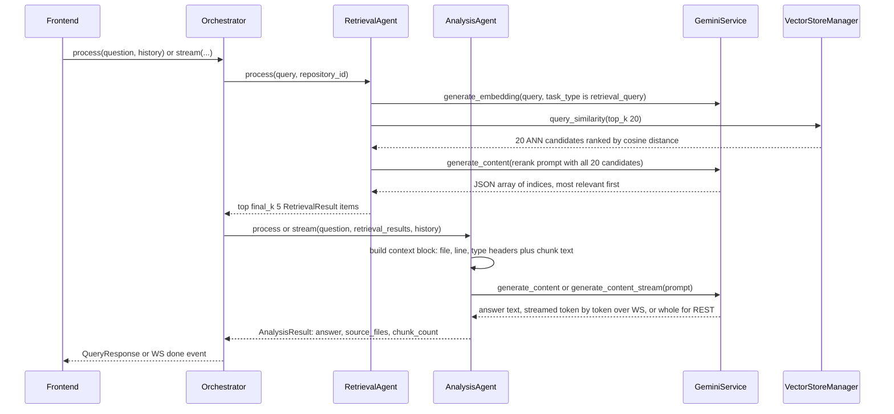

# 01 — Architecture

## System diagram

## Two pipelines

The whole system decomposes into exactly two pipelines. Everything else (UI, state
management, rate limiting) exists to support these.

### 1. Ingestion pipeline (`POST /api/v1/ingest`)

### 2. Query pipeline (`POST /api/v1/query` or `WS /api/v1/ws/query`)

## Component responsibilities

| Component | File | Responsibility |
|---|---|---|
| `GitHubService` | `backend/src/services/github.py` | Clone a repo (shallow, via subprocess `git clone --depth 1`), walk the tree filtering supported extensions/ignored dirs, read file contents as UTF-8, and separately fetch repo metadata/commits/PRs via the GitHub REST API (PyGithub). |
| `CodeChunker` | `backend/src/services/chunker.py` | Turn a `CodeFile` into a list of `Chunk`s. Python files are parsed with `ast` and split at the class/function level; everything else uses character-based sliding-window chunking with overlap. Oversized chunks are recursively split. |
| `filter_chunks_for_embedding` | `backend/src/services/ingestion.py` | Drops empty/whitespace-only chunks before they're sent to the embedding API; raises if *nothing* survives. |
| `GeminiService` | `backend/src/services/gemini.py` | Wraps `google.generativeai`: single/batch embedding generation (with a token/request sliding-window `RateLimiter`, retry+backoff, checkpoint/resume against ChromaDB, adaptive batch sizing), plus blocking and streaming text generation. |
| `VectorStoreManager` | `backend/src/db/chroma.py` | Thin wrapper around a local persistent `chromadb.PersistentClient`. One **collection per repository**, always created with `hnsw:space = "cosine"` (Gemini embeddings are unit-normalized, so cosine, not Chroma's default L2, is correct). |
| `RetrievalAgent` | `backend/src/agents/retrieval.py` | Embeds the query (`task_type="retrieval_query"`), fetches `top_k` ANN candidates, then reranks all of them in a single batched Gemini prompt down to `final_k`, with a graceful fallback to raw ANN order if reranking fails. |
| `AnalysisAgent` | `backend/src/agents/analysis.py` | Builds a context block from retrieved chunks + a short conversation-history block, asks Gemini for a grounded answer (blocking or streamed), and also generates repository overviews and commit summaries. |
| `Orchestrator` | `backend/src/agents/orchestrator.py` | A 2-node **LangGraph** `StateGraph` (`retrieve` → `analyze`) for `process()`; a hand-written async generator for `stream()` since LangGraph nodes return whole state, not incremental tokens. |
| `routes.py` | `backend/src/api/routes.py` | FastAPI endpoints, dependency-injected singletons (`lru_cache`), and **process-global "active repository" state** (`_active_repository` / `_active_repository_context`) — this app supports exactly one active repository at a time per backend process. |
| Frontend `*Store` (Zustand) | `frontend/src/features/*/store/*.ts` | Per-feature client state + the async actions that call the corresponding `*Service`. |
| Frontend `*Service` (Axios) | `frontend/src/features/*/services/*.ts`, `frontend/src/services/base-service.ts` | Thin typed wrappers around `apiClient` (a shared Axios instance), one singleton per feature. |

## Key design decisions and why

- **Cosine similarity, not Chroma's L2 default.** Gemini embeddings are unit-normalized
  vectors, so cosine distance ranks correctly; L2 does not. `VectorStoreManager.get_collection`
  always passes `metadata={"hnsw:space": "cosine"}`.
- **`retrieval_document` vs `retrieval_query` embedding task types.** Gemini embeds text
  differently depending on whether it's a document being indexed or a query searching for
  one. Using the wrong type at either end silently produces near-random retrieval — this is
  called out explicitly in both `gemini.py` and `retrieval.py` because it's the most common
  RAG bug.
- **A separate rerank step.** ANN search over embeddings is fast but approximate; a single
  batched LLM call that sees all `top_k` candidates at once and asks the model to *rank* them
  (rather than re-embedding or re-scoring one at a time) is cheap and meaningfully improves
  precision. It fails soft: if the model call or JSON parsing fails, retrieval falls back to
  the raw ANN order rather than erroring the whole query.
- **LangGraph for `process()`, hand-rolled async generator for `stream()`.** The graph makes
  the non-streaming retrieve→analyze pipeline declarative and easy to extend with more nodes
  later. But LangGraph nodes return complete state dicts, not incremental values, so it can't
  express "yield tokens as they arrive" — the streaming path (`Orchestrator.stream`) calls the
  two agents directly instead of going through the compiled graph.
- **One active repository per backend process, held in globals.** `_active_repository` and
  `_active_repository_context` in `routes.py` are simple module-level variables, not a
  database row or session. This is intentional for the current scope (single-user, one
  ingested repo used for chat at a time) — `/repositories` + `/repositories/{name}/select`
  exist so the frontend can switch between *already-ingested* collections without re-embedding,
  but only one can be "active" for `/query` at a time.
- **No Next.js rewrite proxy.** The frontend calls the FastAPI backend directly
  (`frontend/src/lib/api-client.ts`) instead of using `next.config.ts` rewrites, because
  `next dev`'s internal proxy has its own ~20s timeout that a real multi-minute repository
  ingest routinely exceeds — and tearing down that proxied connection previously crashed the
  whole dev server process.
- **WebSocket streaming with a REST fallback.** `useChatStore.runQuery` tries
  `queryStreamClient` (WS `/ws/query`) first for token-by-token streaming; if that throws for
  any reason (e.g. a proxy blocking WS upgrades), it transparently falls back to the blocking
  `POST /query` endpoint so the user still gets an answer.
- **Checkpointed, rate-limited embedding batches.** `GeminiService.generate_embeddings_batch`
  builds batches bounded by item count, character count, *and* estimated token count; it
  checks ChromaDB for already-embedded chunk IDs first (so a crashed/retried ingest doesn't
  redo work) and writes each batch to ChromaDB immediately after embedding it, rather than
  waiting for the whole repo to finish.
- **AST-based chunking for Python, sliding-window elsewhere.** Splitting at class/function
  boundaries keeps each chunk semantically coherent for embedding search; languages without a
  parser available get overlapping character-window chunks instead of one giant per-file blob,
  and a file-path header comment (`# File: ...`) is prepended to every chunk so filename
  queries still retrieve the right chunk even if the code body never repeats the filename.

## Data model reference

| Type | File | Fields |
|---|---|---|
| `CodeFile` | `chunker.py` | `file_path`, `content`, `language`, `metadata` |
| `Chunk` | `chunker.py` | `chunk_id` (sha256), `file_path`, `content`, `chunk_type` (`class`/`function`/`file`), `metadata` (`name`, `start_line`, `end_line`, `chunk_part`/`chunk_parts` when split) |
| `RetrievalResult` | `agents/retrieval.py` | `chunk_id`, `file_path`, `content`, `score` (cosine distance), `metadata` |
| `AnalysisResult` | `agents/analysis.py` | `answer`, `source_files`, `chunk_count` |
| `OrchestratorResult` | `agents/orchestrator.py` | `answer`, `source_files`, `retrieved_chunks` |
| `AgentState` (LangGraph state) | `agents/orchestrator.py` | `question`, `history`, `retrieval_results`, `analysis_result`, `error` |
